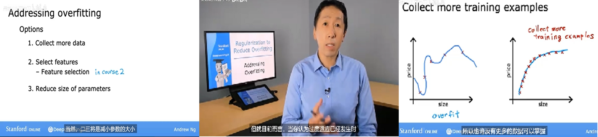

# A Multi-Label EEG Dataset for Mental Attention State Classification in Online Learning
Paper Link: 

## Project Description
This is the Multi-label EEG dataset for classifying Mental Attention states (MEMA) in online learning. We meticulously designed a reliable and standard experimental paradigm with three attention states: neutral, relaxing, and concentrating, considering human physiological and psychological characteristics. This paradigm collected EEG signals from 20 subjects, each participating in 12 trials, resulting in 1,060 minutes of data. Emotional state labels, basic personal information, and personality traits were also collected to investigate the relationship between attention and other psychological states. Extensive quantitative and qualitative analysis, including a multi-label correlation study, validated the quality of the EEG attention data.

## Experiment Setup
The whole process of acquiring attention EEG signals is shown in figure, with each module to be detailed in the following sections. Each collection session is conducted following the same procedure in a sequential manner.

During the ``preparation before recording" phase, the collector prepares the appropriate scene setting, including all questionnaires and equipments needed for the collection process. Subsequently, each subject must complete a personal information questionnaire and a Big Five Inventory (BFI) questionnaire. Afterward, researchers will explain the data collection process in detail to the subjects until they fully understand it. The details of scene setting and information collection will be introduced later.

During the ``EEG data recording" phase, each subject will undergo a total of 12 tasks (trials) of three different types. The process is similar for each task or trial, as shown in the right part of Figure~\ref{protocol}. It starts with a 5-second hint of start, followed by a video clip that varies in length from 1 to 6 minutes, depending on the type of task. After watching the video, there is a 15-second self-assessment period for subjects to evaluate their attention and emotional states during the video. Detailed task design and assessment methods will be presented subsequently.
After that, there is a 15-second rest period. If subjects feel the rest period is insufficient, they can choose to extend it until they are ready. This cycle repeats until all 12 trials are completed.

## Task Design for Each Trail
Taking into account the physiological and psychological characteristics of individuals and drawing upon existing research, we categorize attention states into three types: ``neutral", ``relaxing", and ``concentrating", and develop a specific experimental task for each state.

Each subject will undergo four rounds of experiments, each containing one instance of each task type, totaling 12 trials. The order of the tasks within each round is randomized to prevent fixed sequence effects that could bias subjects and thus impact data reliability. We provide a detailed description of each type of task as follows:

``Neutral" Task:  For this task, the computer plays a one-minute blank video, and subjects simply need to maintain a normal state and watch the computer screen. The ``Neutral" state falls between ``relaxing" and ``concentrating". Subjects are neither actively relaxing nor consciously focusing their attention.

``Relaxing" Task: For this task, the computer plays a soothing video of beautiful scenery for about 5 minutes to help subjects relax and reduce their focus. Additionally, relaxing music is played alongside the video, which has been proven to aid in physiological and psychological relaxation. This task requires subjects to maintain a relaxed state as much as possible.

``Concentrating" Task: For this task, the computer plays a video clip from a well-known machine learning course, covering a complete knowledge point. Each clip lasts about 5 minutes, a duration chosen based on research on the Continuous Performance Test (CPT) task. Subjects are required to concentrate as much as possible on the course content, actively learn, and think about the material. At the end of each video clip, subjects are asked to answer a simple multiple-choice question related to the video content to assess whether they were focused on learning online. 

Figure shows some snapshots of video clips for the ``Concentrating" and ``Relaxing" states.

## Dataset description:

The first part is the raw data, which includes EEG data of 20 subjects throughout the entire session, including the rest process. Among them, Data1 is the gyroscope data, with a data format of: data * channel. The data contained in the channel is sequentially packet index, Pitch angle, Roll angle, Yaw angle, x-axis angular velocity, y-axis angular velocity, z-axis angular velocity, x-axis acceleration, y-axis acceleration, z-axis acceleration, and time scale; Data2 is EEG data in the format of data * channel, where the first 32 channels contain 32 channel EEG data, the 33rd channel is the data index, and the 34th channel is the added time scale. Time markers are used to distinguish between task status and rest status.

The second part is in drawing format, which includes data from 12 trials after segmenting the original data, as well as corresponding files in. set and. fdt formats.

The third part is For-DL, which consists of 20 subjects' EEG data in. mat format and 4 types of label files (attention and 3D emotion) The mat file contains EEG data from 12 trials of the same subject, in the format of channel * data.

The fourth part is For-ML, where Subject_123 is the EEG data of the first 9 trials, Subject_4 is the EEG data of the last 3 trials, and Subject is all EEG data of the subject. This part of the data is labeled by suffix.

## Dataset usage
Dataset is available at: https://pan.baidu.com/s/1r-_DhrWga-vGtEzWAqDB6g?pwd=mema 

